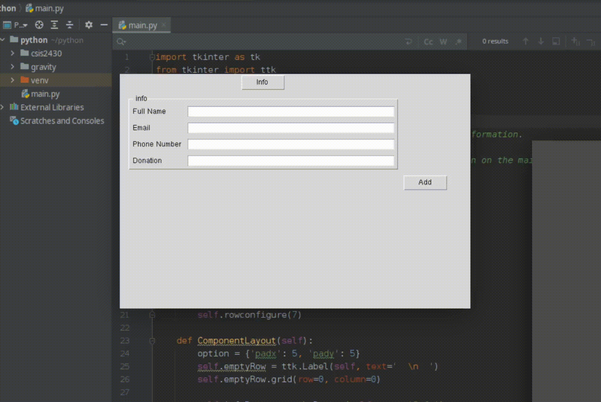

# CSIS2700
The group event's CSIS component

The csis component is a GUI form. The window shows entries to take in information about the people coming to event.
The child window shows the table of those that have information inputted.
Demo

Require:
- Tkinter library
- 
TODO
- Add more entry to the form.
- Add functions to the tables to allow editting, removing and auto-update records.
- Add function to manage the photo from photo session, and autosend the photo via email.
- Connect the GUI to the back-end database(from James). 
    + optional, add credential check to manage photo, and infomation.
    + Add form to input photos and upload to database.
